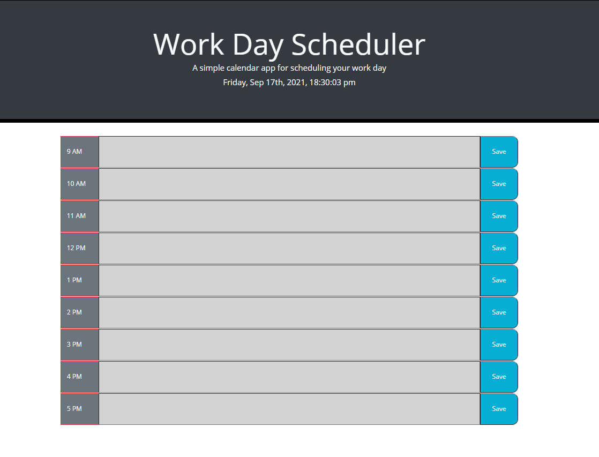

# Daily-Planner

## Description

This app was designed to be a daily planner whererin appointments can be entered into the corresponding hour blocks and stored in localStorage for access even upon page reload. 

## Usage

This app functions simply, using text entry and save button functionality to store input data into localStorage. This data is then loaded into the proper location upon page load and persists through multiple reloads. 

The app is live at this URL: https://lamperouge1218.github.io/Daily-Planner/

and here is a screenshot of the final product's intial page: 

## Credits

For this project, I collaborated with [Mark Lindsey](https://github.com/mrl-jr). I also used the sites [W3Schools](https://www.w3schools.com/) and [MDN Web Docs](https://developer.mozilla.org/en-US/) to assist with localStorage. 

## License 

MIT License

Copyright (c) [2021] [PhilBohn]

Permission is hereby granted, free of charge, to any person obtaining a copy
of this software and associated documentation files (the "Software"), to deal
in the Software without restriction, including without limitation the rights
to use, copy, modify, merge, publish, distribute, sublicense, and/or sell
copies of the Software, and to permit persons to whom the Software is
furnished to do so, subject to the following conditions:

The above copyright notice and this permission notice shall be included in all
copies or substantial portions of the Software.

THE SOFTWARE IS PROVIDED "AS IS", WITHOUT WARRANTY OF ANY KIND, EXPRESS OR
IMPLIED, INCLUDING BUT NOT LIMITED TO THE WARRANTIES OF MERCHANTABILITY,
FITNESS FOR A PARTICULAR PURPOSE AND NONINFRINGEMENT. IN NO EVENT SHALL THE
AUTHORS OR COPYRIGHT HOLDERS BE LIABLE FOR ANY CLAIM, DAMAGES OR OTHER
LIABILITY, WHETHER IN AN ACTION OF CONTRACT, TORT OR OTHERWISE, ARISING FROM,
OUT OF OR IN CONNECTION WITH THE SOFTWARE OR THE USE OR OTHER DEALINGS IN THE
SOFTWARE.